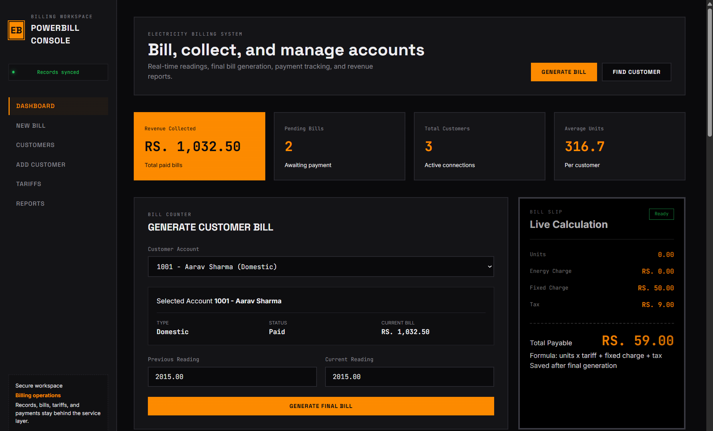
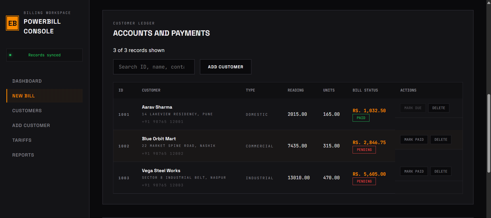
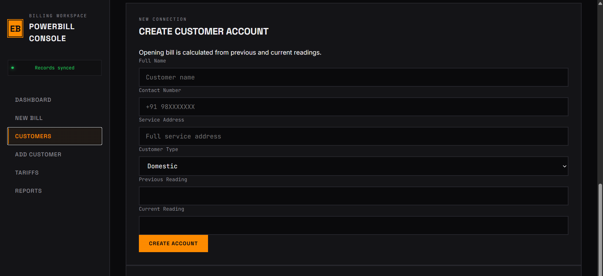
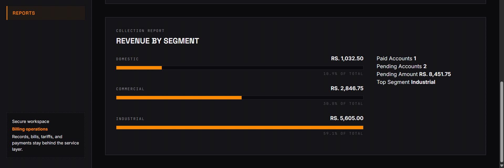
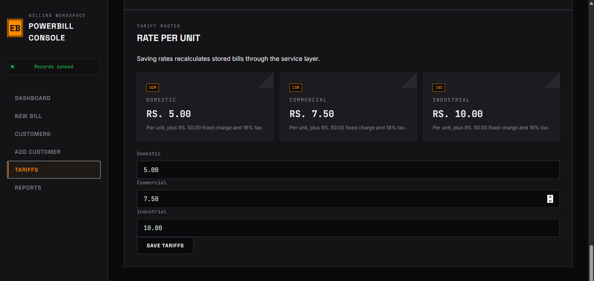

<div align="center">



# ⚡ POWERBILL CONSOLE
### Industrial-Grade Electricity Billing & Management System

[](https://github.com)
[](https://github.com)
[](https://github.com)
[](https://github.com)

**A premium, high-performance billing interface designed for technical precision and operational efficiency.**

[Explore Features](#-system-walkthrough) • [Deployment](#-live-deployment) • [API Reference](#-api-endpoints)

</div>

---

## 🖥️ System Walkthrough

### **01. Central Control Dashboard**
The heartbeat of the system. Real-time monitoring of revenue, pending bills, and active customer counts with an integrated live bill generation slip.



---

### **02. Operational Modules**

<table align="center">
  <tr>
    <td width="50%">
      
      <br>
      <b>CUSTOMER LEDGER</b>
      <p>Manage connection types (Domestic, Commercial, Industrial) and track live readings in a unified industrial database.</p>
    </td>
    <td width="50%">
      
      <br>
      <b>REVENUE ANALYTICS</b>
      <p>High-level breakdown of collection reports by segment with percentage-based revenue tracking.</p>
    </td>
  </tr>
  <tr>
    <td width="50%">
      
      <br>
      <b>TARIFF MASTER</b>
      <p>Configure dynamic unit rates and fixed charges. Saving rates triggers a global bill recalculation via the C++ service layer.</p>
    </td>
    <td width="50%">
      <div align="center">
        <br><br>
        
        <br><br>
        
        <br><br>
        
      </div>
    </td>
  </tr>
</table>

---

## 🛠️ Industrial Design System

The **Powerbill Console** is built on a custom industrial design language that prioritizes legibility, speed, and a "hardware-first" feel.

- **High-Contrast Interface**: Optimized for long-session monitoring with a `#0a0a0c` deep-space background.
- **CRT Rendering Engine**: Integrated scanline overlays and subtle bloom effects simulate a professional billing terminal.
- **Technical Typography**: Utilizing **Space Grotesk** for architectural hierarchy and **JetBrains Mono** for pixel-perfect data readouts.
- **Tactile Brutalism**: Sharp 2px corners, solid borders, and "mechanical" transitions replace soft modern gradients.

---

## 🚀 Technical Features

### **C++ High-Performance Backend**
The core is powered by a native C++17 HTTP service, ensuring sub-millisecond response times for critical billing calculations. No heavy frameworks—just pure, optimized machine code.

- **Real-Time Calculation Engine**: `Total = (Units × Tariff) + Fixed Charge + Tax (18%)`
- **Binary Data Persistence**: Uses custom `.dat` storage for lightweight, fast I/O operations.
- **RESTful API Architecture**: Clean separation between the "Service Layer" and the "Brutalist Frontend".

---

## 📦 Build & Installation

### **1. Prerequisites**
- C++ Compiler (GCC/G++ recommended)
- Windows (WinSock2) or Linux environment

### **2. Build the Service**
```bash
# Compile the main API server
g++ backend_server.cpp -std=c++17 -Wall -Wextra -pedantic -o BillingBackend.exe -lws2_32
```

### **3. Start the Console**
```bash
# Run the binary
.\BillingBackend.exe
```
Visit `http://localhost:8080` to access the terminal.

---

## 🌐 Live Deployment

The system is container-ready for industrial deployments.

### **Docker Deployment**
```bash
docker build -t powerbill-console .
docker run -p 8080:8080 powerbill-console
```

---

## 🔌 API Endpoints

| Method | Endpoint | Description |
| :--- | :--- | :--- |
| `GET` | `/api/state` | Full system state (Customers, Tariffs, Reports) |
| `POST` | `/api/customers` | Register new industrial/domestic connection |
| `POST` | `/api/bills/generate` | Finalize reading and push to ledger |
| `POST` | `/api/payments` | Toggle invoice payment status |
| `POST` | `/api/tariffs` | Update global rates and trigger recalculation |
| `DELETE` | `/api/customers/{id}` | Purge customer record from database |

---

<div align="center">

*Developed for industrial-grade billing precision.*  
**⚡ POWERBILL CONSOLE // SYSTEM VERSION 1.0.4**

</div>
